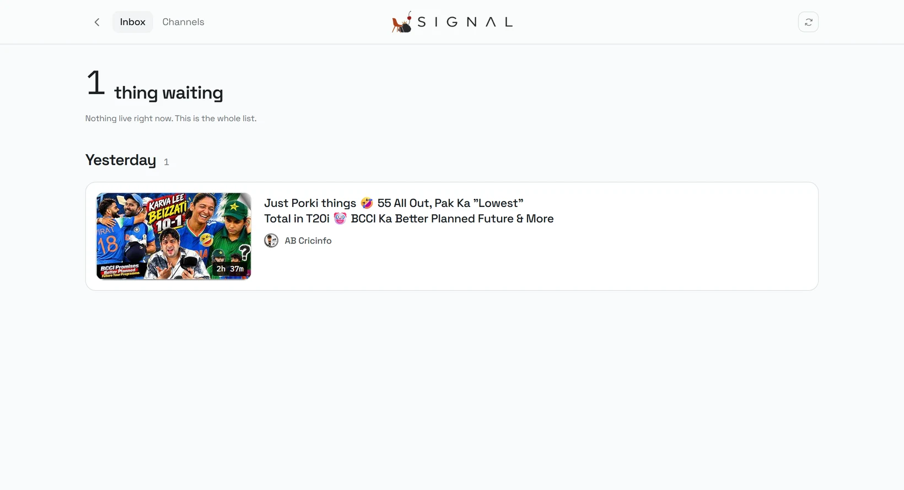
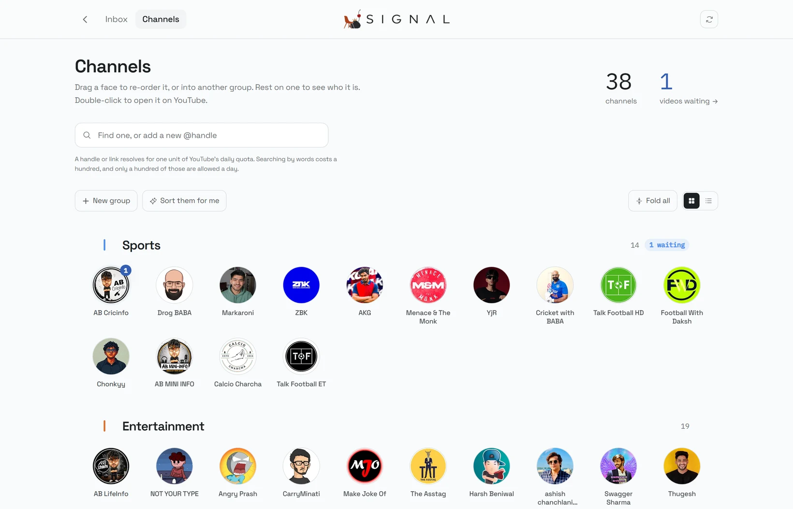

<div align="center">


# SQUIRL

**A place for software you actually own.**

Squirl is a personal workspace that runs on your own machine.
No account, no server, no sync, no telemetry. One file holds everything.

Its first application is **Ledger**, which keeps money you *spent*,
money you *lent*, and money you *put away* as three different things.

[What Squirl is](#what-squirl-is) · [The launcher](#the-launcher) · [Ledger](#ledger-the-first-application) · [Run it](#run-it) · [Under the hood](#under-the-hood)

<br>


</div>

---

## What Squirl is

Most software you use is a tenant on someone else's computer. It can change
under you, start charging, start watching, or disappear. Squirl is the
opposite arrangement: it runs on your machine, against a file you can copy,
open with any SQLite tool, and delete.

That is the whole premise. Everything below follows from it.

**Squirl is not one app.** It is the environment those apps live in. It owns
the identity, the lock, the theme, where the data sits, and how it gets backed
up. Applications own their own subject: their nouns, their screens, their
vocabulary, their workflows.

That split is deliberate, and it is the thing being protected here:

|  | Squirl | An application |
|---|---|---|
| Owns | identity, shell, lock, theme, storage, backup | its domain model, screens, language |
| Knows about | that applications exist, and how to list them | itself, and nothing else |
| Never does | hold domain logic for any one app | reach into another app's data |

Squirl knows Ledger exists. Ledger does not know Squirl has other plans.

### What is inside, right now

| | Application | State | What it is for |
|---|---|---|---|
|  | **Ledger** | Built | Money. What you spent, what you lent, what you owe, what is safe to spend. |
|  | **Form** | Planned | Training, and what it is actually doing to you. |
|  | **Signal** | Built | Attention. What the channels you chose have published, as a queue that ends. |

Two of those three are real. Form holds a place and says so, on the screen as
well as here: it shows no figures, it has no route to open, and its card says
"not built yet" rather than filling the space with a plausible number.

That is deliberate. A launcher that quietly invents data for the applications
it has not written yet teaches you not to trust the ones it has, and the first
real number to appear would not be believed.

### The rules it holds itself to

- **Local by default.** Nothing leaves the device. There is no account to make.
- **Your data is inspectable.** One SQLite file, ordinary tables, plain columns.
- **Deterministic.** The same input produces the same result. No model calls in
  anything that has to be trustworthy.
- **No dark patterns.** Nothing nags, streak-shames, or invents urgency.
- **Focused apps, not one bloated one.** A shared home, not a shared blob.
- **No premature abstraction.** There is no universal "item" every future app
  must inherit. Real domains get real nouns.
- **An app must be removable.** Delete its directory and its tables, and the
  rest keeps running.

---

## Getting in

Squirl opens on a lock screen. The default credentials are:

```
username   Siddhant_Squirl
password   LocalSquirl_123
```

Change them with `SQUIRL_USERNAME` and `SQUIRL_PASSWORD` in a `.env.local`
file, and set `SQUIRL_SESSION_SECRET` if you would rather pin the signing key
than let it be generated into `data/`.

**Be clear about what this lock is.** It stops someone idly opening the tab on
a shared desk. It is not encryption. `data/squirl.db` sits on disk in the
clear, and anyone holding the machine can read it with any SQLite browser. The
lock screen says so out loud rather than implying protection it does not
provide.

Past the lock is Squirl's home.


The picture behind the sign-in is a matched pair, day and night. Which one you
get is decided by two things and nothing else: the hour, resolved in IST on the
machine, and the theme. A theme you chose by hand wins over the clock, so
picking Light at eleven at night gets you a light screen; left on System, the
hour decides. Nothing announces it and there is no control for it.

---

## The launcher

<table>
<tr>
<td width="50%"></td>
<td width="50%"></td>
</tr>
</table>

Squirl's home is three columns and a dock, and it is sized to be read without
scrolling at laptop heights as well as monitor ones. It answers one question,
"what do I have and does any of it need me", and then gets out of the way.

**The orbit is the product's own model of itself, drawn literally.** The mark
in the middle is the environment; each body going round it is an installed
application in its own colour; built ones ride the inner ring because those are
the ones you reach for. It is genuinely three-dimensional rather than a flat
ring pretending: bodies are placed in an orbital plane, tilted, spun about the
vertical axis and projected, so they pass behind the mark and come round the
front larger and brighter. Drag it and it spins, keeps the momentum you gave it,
and settles back to a slow drift rather than to a stop. Three rings are drawn
whether or not they are all occupied, so a fourth application arrives into a
place that was already there.

**The tiles are doors, not reports.** Each one carries a mark, a line about what
the application is for, and at most one live figure read from that application's
own data at render time. Drag a tile by its grip and the row rearranges around
it, and the order you leave it in is the order you get back. Right-click one for
the things that are not "open it".

**The dock belongs to the window, not the page.** It costs the layout no height,
it can be dragged to any of the four edges, and it settles centred on the wall
you drop it nearest, upright on the left and right. Where you left it is where
it starts. `Ctrl` `\` takes it away and brings it back.

### Keys

| Key | What it does |
|---|---|
| <kbd>Ctrl</kbd> <kbd>K</kbd> | The command palette: every application, every screen inside them, the theme, the lock |
| <kbd>Ctrl</kbd> <kbd>\\</kbd> | Hide the dock, and bring it back |
| <kbd>1</kbd> <kbd>2</kbd> <kbd>3</kbd> | Open an application by its place in the row |
| <kbd>Esc</kbd> | Close whatever is open |

There is no search field on the screen. Three applications do not need one, and
a permanent input would spend the best space on the page implying a catalogue
too large to look at.

---

## Ledger, the first application

Almost every money app tracks one number: how much you have.

That number quietly lies to you, because it treats three completely different
events as the same thing:

| You did this | A normal tracker says | What actually happened |
|---|---|---|
| Moved ₹15,000 into savings | You spent ₹15,000 | You still have it. You just made it hard to reach. |
| Lent a friend ₹1,000 | You lost ₹1,000 | You still own it. It is not with you right now. |
| Bought a ₹1,000 phone case | You spent ₹1,000 | Correct. It is gone. |

Only the third one is spending. The other two changed your **access** to money,
not the **amount** of it. Blur those together and your balance starts feeling
random: some weeks end flush, some end at zero, and nothing explains why.

Ledger refuses to blur them. A squirrel does not eat its whole hoard just
because it can reach it.


### Five piles, never added together

|  | What it is | Counts as yours | Spendable today |
|---|---|---|---|
| **In hand** | bank, cash, wallet | yes | yes |
| **Stashed** | savings, money held by family | yes | no, by design |
| **Owed to me** | lent out, plus any interest | yes | no |
| **I owe** | borrowed money and loans | it is a debt | no |
| **Promised** | due inside the next 30 days | already counted | set aside |

Lending ₹1,000 leaves your net worth untouched and drops what is in hand by
₹1,000. That single distinction is the reason this exists, and there is a test
that fails if it ever stops being true.

### One number, and it shows its working

**Safe to spend** = in hand, minus everything due in the next 30 days, minus
your buffer.

It is never asserted without proof. One tap accounts for every rupee between
the two figures and lists each obligation by name and date. An app that tells
you a number and refuses to explain it has not earned the right to be believed.

### Logging something costs less than the thing you bought

There is one text box. Type it the way you would say it out loud.

```
chai 20                    →  ₹20 spent, Chai and snacks, today
250 zomato upi             →  ₹250, Food delivery, paid by UPI
+5000 freelance            →  ₹5,000 in, Side income
lent 1000 to rahul         →  a receivable, and Rahul is created if new
rahul paid back 1000       →  a repayment against that debt, not income
moved 15000 to savings     →  a transfer, not a spend
899 netflix card 2 aug     →  backdated, method and category detected
```

It parses on every keystroke and shows you what it understood *before* you
commit. No model call, no network, no latency, and the same words always
produce the same entry. Dates handle `today`, `yesterday`, `kal`, `aaj`,
`3 days ago`, `last friday`, `2 aug`, `12/7`. Amounts handle `1.2k` and `2L`.

### Debts that behave like real life

Money between friends is messy: partial repayments, no fixed date, sometimes
interest, sometimes settled six months later. Ledger replays each debt as a
timeline rather than storing a balance, so every amount accrues from its own
day and a repayment clears interest before it touches principal, which is how
people actually settle up.

### Loans, entered the way they are actually sold

You are told *"borrow ₹1,500, pay ₹550 a month for 3 months"*, never a rate.
So that is what Ledger asks for. Then it tells you what it really costs:

> **₹1,500 repaid as ₹550 × 3 is an effective 78% a year**, not the 10% the
> headline implies, because what you owe shrinks while the payment does not.

The full instalment schedule is generated, and every upcoming payment is
subtracted from what is safe to spend today.

### Subscriptions that log themselves

The ₹179 you find on a statement four days later and cannot place: that is what
this solves.

Add a subscription or auto-debit once with its amount, how often it bills, and
the date it first charged. Anything you mark as leaving on its own gets written
into your history on its due date without asking, because the bank takes it
whether you are watching or not. If your machine was off, it catches up every
missed charge the next time you open the app.

Any interval works: monthly, quarterly, every six months, yearly, weekly, or a
custom number of days, weeks, months or years, with an optional end date.
Month-end billing is handled properly, so something charged on the 31st goes
31 Jan, 28 Feb, 31 Mar, rather than slipping to the 28th forever.

Things that only *usually* go through can be left as reminders instead: they
wait on the Repeating page and ask before recording anything. Either way, every
posted charge is a normal entry you can open, edit or delete, and upcoming ones
are already subtracted from what is safe to spend.

### It stays honest when you forget

Tap-to-pay is easy to forget, and one missed ₹40 chai makes every figure
slightly wrong. Rather than pretend that never happens, open your banking app,
type what it *actually* says, and Ledger writes the difference into your
history as a real entry with a reason. The record corrects itself instead of
slowly drifting into fiction.

### Progress worth having

A streak, a stash that grows, and milestones earned by genuinely improving your
position: a debt cleared, a loan finished, a balance checked against reality.

No XP, no levels, no daily quests, no confetti. Points would reward you for
opening an app. These only reward you for knowing where you stand. Your
best-ever streak is kept permanently, so a bad week never erases a good month.

### Days, not clocks

The unit is the day, because that is what people actually ask ("what did I
spend on Tuesday"). There are no timestamps anywhere in the model, and "today"
always resolves in IST no matter what the machine thinks.

---

## Signal, the second application

YouTube's home page is very good at one thing, and it is not the thing you
opened it for. You went to see whether a particular person had posted, and
forty minutes later you have watched four things you were never looking for.
The subscriptions feed does not help: it is infinite, it mixes Shorts and
community posts in with the videos, and nothing on it is ever finished.

Signal is the other shape. It watches only the channels you name, it holds what
they published in a list that **gets shorter**, and when the list is empty it
says so and stops.

| | YouTube | Signal |
|---|---|---|
| What you see | what it decided you would watch | what the channels you chose published |
| How it ends | it does not | when the list is empty |
| Shorts and posts | mixed in | never imported |
| What it remembers | everything you watched, forever | that you dealt with an item, and never counts it |
| Where it runs | their servers | your machine, from one SQLite file |



There is no YouTube account involved. Signal never signs in as you, so it can
neither read your history nor write to it. It reads the public upload feed of
public channels with an ordinary API key, which is the same thing a browser
does when it loads a channel page.

### Two screens, and they answer different questions

**The inbox** is the queue: how many things are waiting, at the top, and then
those things in the order they happened, cut into days. Within one day, order
follows the shelf: the category you put first comes first, and inside it the
channel you put first comes first, so the arrangement you built by hand on the
Channels page is the order you read the queue in too, not an accident of when
YouTube happened to publish each thing.

Every row can be dealt with three ways and all three end it — **done**,
**dismiss**, or **open on YouTube** — and each shows a brief mark of which one
you chose before the row leaves, so a click reads as landed rather than the row
simply vanishing under the pointer. There is no fourth option, and there used
to be: a "later" button that put an item back at a chosen hour. It was removed.
YouTube already has Watch Later and is welcome to it. A queue whose entire
promise is that it gets shorter should not ship the one control that lets you
avoid deciding.



**The shelf** is the channels: every one you follow drawn as its avatar,
because that is how you actually recognise a creator, grouped however you like.
Drag a face to move it, drag a group to reorder it, and everything shifts live
so the drop confirms an arrangement you can already see. There are two layouts —
faces for recognising, rows for auditing — and it remembers which you last used.

Groups are told apart by colour rather than by rules drawn across the page. The
hue comes from the group's own name, so it is the same colour on every machine
and after every reload without a colour ever being stored.

### It only ever knows about days that have already started

Signal has a **baseline**: an instant before which nothing is ever imported, on
any sync, ever. It is a floor inside the sync engine and not a filter on a
screen — the rows are never written down at all — so "how far back does this
go" is a fact about the data rather than a habit of whichever query you
happened to write. A queue that opens with four hundred unread items is the
exact thing this exists to prevent.

Livestreams are filed by when they **started**, not when they were published.
YouTube stamps a broadcast as published the moment it *ends*, so a show that ran
from ten at night until half past one would otherwise land on the following day
and be filed under a date nobody watched it on.

### It knows a Short when it sees one

YouTube's API has no field that says "this is a Short". The obvious guess —
anything under a minute — stopped being reliable in October 2024, when YouTube
let Shorts run up to three minutes: a duration cutoff either lets the longer
ones through or starts rejecting ordinary short uploads that were never Shorts
at all. Signal instead reads the same auto-generated playlist YouTube's own
website uses to populate a channel's Shorts shelf, which says definitively
rather than guessing from a number, at the cost of one extra quota unit and
only on a pass where there is something new to check.

### It syncs itself, and cannot open a gap

The background sync runs inside the Squirl process — no cron, no cloud
scheduler, nothing to keep running when the app is not. It goes every hour,
and also on startup, on the machine coming back online, when the last run is
stale, and whenever you press the button.

Signal notices its own sync landing, too. A tab left open polls a tiny piece
of the scheduler's own state every twenty seconds — not the database, not
YouTube, just a number already sitting in memory — and refreshes itself the
moment that number changes. Leaving the inbox open is enough; nothing has to
be reloaded by hand for new videos to appear.

It is **checkpoint-based and idempotent**, which together mean offline time
cannot cost you anything. Each channel remembers the last video it saw; a sync
asks for everything after that. A failed sync is itself the connectivity probe,
so there is no separate health check to get wrong, and the first success after
a failure is automatically the catch-up because it resumes from the checkpoint
rather than from the clock. Running it twice writes nothing twice: the YouTube
id is unique, and the upsert has **no permission** to write the state column, so
no sync can ever resurrect something you already dealt with.

### The quota is a design constraint, not an afterthought

YouTube gives a free key 10,000 units a day. `search.list` costs **100 units**
and is separately capped at 100 calls a day; `channels.list`,
`playlistItems.list` and `videos.list` cost **one unit** each for up to 50 items.

So Signal never searches during monitoring. Adding a channel resolves the handle
directly for one unit rather than searching for a hundred, and the routine
three-hourly pass costs roughly one unit per channel. Thirty-eight channels cost
about 38 units a pass, or a few hundred a day against an allowance of ten
thousand.

Keys are pooled and rotated, and an exhausted one is rested until quota reset
rather than retried into the ground.

### Filing, with a model and without one

New channels are filed into groups by a keyword heuristic, and by Gemini when a
key is available — including the moment a single channel is added, not only in
a batch. The heuristic alone was wrong in a way worth recording: several
comedians filed themselves under Business, because their channel descriptions
contain the phrase "business enquiries". The classifier now strips contact
boilerplate before matching.

Adding a channel shows where it landed, right then: which category, and
whether a model placed it or the keyword table did. Changing it is one click
from that same dialog, because the moment you are already looking at the
decision is a better time to correct it than three scrolls later on the shelf.

Anything you file by hand is locked and never re-classified. A "sort them for
me" button that undid your own corrections would be a button nobody presses
twice.

---

## Run it

You need **Node 20.9 or newer**. Nothing else to install, no Docker, no
sign-up. Ledger needs no keys at all; Signal needs a free YouTube key to fetch
anything.

```bash
git clone https://github.com/PathakSiddhant/squirl.git
cd squirl

npm install
npm run setup     # creates the file, applies migrations, seeds accounts and categories
npm run dev
```

Open **http://localhost:3000** and sign in with the credentials above.

### Signal's keys, if you want Signal

Ledger needs nothing. Signal needs a YouTube Data API v3 key to read public
channels, and optionally a Gemini key to file them into groups. Both are free.
Put them in `.env.local`, which is gitignored and never committed:

```bash
# Comma-separated pools. Each key is a separate Google project with its own
# daily allowance, so rotating across them multiplies the ceiling and one
# exhausted key never stops the application.
YOUTUBE_API_KEYS=AIza...,AIza...
GEMINI_API_KEYS=AIza...,AIza...
```

Get a YouTube key from the [Google Cloud console](https://console.cloud.google.com/apis/library/youtube.googleapis.com)
(create a project, enable **YouTube Data API v3**, create an API key) and a
Gemini one from [Google AI Studio](https://aistudio.google.com/apikey).

Without a YouTube key Signal still runs, still draws, and still holds whatever
is already in the database. It simply cannot fetch anything new, and says so
rather than failing quietly. Without a Gemini key the keyword heuristic files
new channels instead.

### Want to look around before committing to it?

```bash
npm run db:demo   # four months of realistic sample data
```

That writes regular income, transfers into savings, a few hundred small
everyday expenses, two people who owe you, one you owe, and a small instalment
loan. Delete `data/squirl.db` whenever you want a clean start.

### Commands

| Command | What it does |
|---|---|
| `npm run dev` | Start the app |
| `npm run setup` | Migrate and seed. The one-time first run. |
| `npm run db:demo` | Add four months of sample data |
| `npx tsx lib/db/reset.ts --yes` | Empty every table, keep the schema |
| `npm run db:studio` | Browse the raw database |
| `npm test` | Run the test suite |
| `npm run typecheck` | Type-check without building |
| `npm run brand:build` | Regenerate marks and icons from the artwork |
| `SIGNAL_SYNC_INTERVAL_MS=…` | Override Signal's one-hour sync interval |
| `npm run build && npm start` | Production build |

### Where your data lives

One file: **`data/squirl.db`**. Copy it and you have copied everything Squirl
holds, across every application. Delete it and nothing of yours remains
anywhere. There is no account to close and nothing to export from a server,
though Ledger's settings has a one-click JSON export anyway.

### Having it always running (Windows)

Rather than starting it by hand each time, you can have it launch silently
whenever you sign in:

```powershell
npm run build
powershell -ExecutionPolicy Bypass -File scripts\windows\install-autostart.ps1
```

That drops a shortcut in your Startup folder pointing at a small VBScript
wrapper, which runs `npm start` with no console window. It uses the Startup
folder rather than Task Scheduler because creating a scheduled task needs
privileges a normal account often does not have.

- Logs go to `logs/squirl.log`
- Stop it any time: `powershell -File scripts\windows\stop-squirl.ps1`
- Undo it: `powershell -File scripts\windows\uninstall-autostart.ps1`
- Moving the project folder breaks that shortcut, since it stores an absolute
  path. Re-run the installer afterwards, or use
  `scripts\windows\rename-project-folder.ps1`, which does both.

It only runs while you are signed in, and rebuilding (`npm run build`) is still
needed after any code change.

### On your phone

Squirl is a PWA, so it installs to the home screen and opens without browser
chrome. It still runs from your computer; the phone is only the screen.

1. Start it on the computer: `npm run build && npm start`
2. Find that machine's address on your network. `npm run dev` prints it, or run
   `ipconfig` on Windows and take the Wi-Fi IPv4 address.
3. With the phone on the **same Wi-Fi**, open `http://THAT-IP:3000`
4. Android Chrome: menu, "Add to Home screen".
   iPhone Safari: share, "Add to Home Screen".

The computer has to be awake and running the app for the phone to reach it. If
the page will not load, Windows Firewall is usually the cause: allow Node.js on
private networks when it asks, or add an inbound rule for port 3000.

Away from home, put both devices on [Tailscale](https://tailscale.com) and use
the machine's Tailscale address instead. That keeps everything private without
exposing anything to the internet. Do not port forward this to the public
internet: the lock is a lock, not a security boundary.

---

## Under the hood

**Next.js 16** (App Router, Server Components, Server Actions) · **React 19** ·
**TypeScript** strict · **SQLite** via **libSQL** with **Drizzle ORM** and
versioned migrations · **Tailwind CSS v4** on a hand-built token layer ·
**Motion** · **Radix** primitives · **Geist**.

libSQL rather than `better-sqlite3` because its bindings ship prebuilt for
every platform, so `npm install` never needs a C++ toolchain.

```
app/
  layout.tsx            fonts, theme, the boot sequence
  lock/                 the threshold. the only route outside the gate.
  (squirl)/
    layout.tsx          the session gate every app route nests under
    page.tsx            Squirl's home: the applications it holds
    ledger/             one application, self-contained
      page.tsx            Today
      history/ accounts/ repeating/ people/ loans/
      insights/ progress/ guide/ settings/
    signal/             the second, equally self-contained
      page.tsx            the inbox: what is waiting
      channels/           the shelf: who is watched, and how it is arranged
  actions/              server actions, validated at the boundary
instrumentation.ts      starts Signal's background sync with the server

lib/
  squirl/               the platform. small on purpose.
    apps.ts               the registry of installed applications
    session.ts            the local lock
  money.ts              integer paise arithmetic, Indian digit grouping
  date.ts               IST day strings, no timestamps anywhere
  domain/
    interest.ts         debt replay, simple and compound accrual
    loans.ts            instalment schedules, four models, an APR solver
    position.ts         the five piles, burn rate, runway
    capture.ts          the natural-language parser
    recurring.ts        billing schedules, drift-free at month end
    achievements.ts     milestones, evaluated from real position
  signal/               the second application's domain
    youtube.ts          the only file that talks to YouTube. Zod at the edge.
    sync.ts             checkpoint-based, idempotent, baseline-floored
    scheduler.ts        the three-hour loop, living in this process only
    queue.ts            what is waiting, and the ways it can end
    channels.ts         the shelf, and filing new arrivals
    intelligence.ts     Gemini, when there is a key. Optional by design.
    keys.ts             key pools, round-robin, rest an exhausted one
    epoch.ts            the baseline. Nothing before it is ever imported.
  db/                   schema, migrations, seed, demo data
  queries/              read models composed from the pure engines above

components/
  squirl/               the launcher, and the screens outside every app
    launcher.tsx          the three columns, and what they are arranged for
    orbit.tsx             the applications, going round, in three dimensions
    app-tile.tsx          one application's door
    dock.tsx              the controls, mounted to a wall of the window
    console-panel.tsx     the clock, and the machine's own figures
    command-palette.tsx   Ctrl-K, over every screen in the product
    storage-sheet.tsx     where the data lives, and which keys do what
    lock-screen.tsx       the threshold
  ledger/ today/ people/ loans/ …   Ledger's own feature components
  signal/               Signal's: the inbox, the rows, the shelf, the faces
  brand/                the marks, Squirl's and each application's
  ui/                   primitives any application may use
```

`lib/squirl/apps.ts` is the entire coupling between the shell and the things it
hosts. An application declares a name, a mark, a route, an accent, and
optionally one live figure for its card. Squirl renders that and nothing else:
it does not know what a transaction is, and it did not need to learn what a
video is. Signal was added by writing an entry there and a directory under
`app/(squirl)` — no change to the launcher, the lock, or the shell.

More on that split in [ARCHITECTURE.md](ARCHITECTURE.md).

Two rules hold the money side together:

**Nothing is stored as a running total.** Balances, debt positions and loan
liabilities are all derived from the ledger. A stored total and a ledger will
eventually disagree, and when they do there is no way to know which one lied.

**Every amount is an integer number of paise.** `0.1 + 0.2 !== 0.3`, and a
ledger that drifts by a paisa a row is a ledger nobody trusts.

### Correctness

```bash
npm test
```

The money maths is the part that has to be right, so it is tested: the float
trap, lakh grouping, leap years, interest landing on exactly one month at the
anniversary whether February had 28 days or March had 31, instalment schedules
summing back to exactly their principal, and the invariant that lending changes
what you can spend without changing what you are worth.

### Design

Charcoal and acorn, taken from the logo rather than chosen beside it. The mark
samples at `oklch(0.36 0.007 235)` and `oklch(0.68 0.087 66)`, and the whole
interface is built on those two hues.

The interface itself is deliberately achromatic. **Colour is data; chrome is
ink.** Every coloured pixel means something specific about money, so nothing is
tinted to look nice, primary buttons are solid ink rather than a brand colour,
and colour stays rare enough to still be a signal.

Each application fills one slot in that system, `--app-accent`. Ledger's is the
desaturated forest green sampled from its own ledger book, and Form's is the
flame off its match. Signal's is the exception that proves the rule: every
colour in its mark landed within about ten degrees of a hue already taken, so
it was given a blue with nothing else near it rather than a sampled one that
would have made its card say "Form". An accent identifies an application, on
its tile and on the selected row of its own navigation. It never colours data,
which has already earned its palette.

Motion is held to things that explain something. A figure counts up to itself
once on arrival, so you can see it was read rather than printed. A tile tips
three degrees towards the pointer and carries a light in its own accent. A
built application's node breathes and an unbuilt one does not. Every one of
them has a `prefers-reduced-motion` path, and the launcher runs on its own
slower durations than the rest of the product, because nothing here is urgent.

Money direction uses a cool/warm pair rather than green/red, so red-green
colour blindness never destroys the most important distinction in the app, and
direction is always carried by a sign glyph as well as a hue. Both themes are
validated for contrast and colour-vision separation rather than eyeballed.

Details in [DESIGN.md](DESIGN.md), and the product thinking in
[PRODUCT.md](PRODUCT.md).

---

## What it deliberately will not do

No bank sync, no cloud account, no multiple users, no receipt scanning, no
investment tracking, no hard budget limits, and no notifications telling you
off. It reports. It does not moralise.

Signal holds the same line on the other side of the house: no YouTube sign-in,
no recommendations, no "you might also like", no watch history, no streaks, no
Shorts, and no infinite anything. It will not tell you how many videos you got
through this week, because that is a statistic about your own attention and
keeping it is how a tool becomes a scoreboard.

And no app store. Squirl holds the applications built for it, not a marketplace
of other people's.

---

## License

MIT. See [LICENSE](LICENSE). Your machine, your data, your software.
